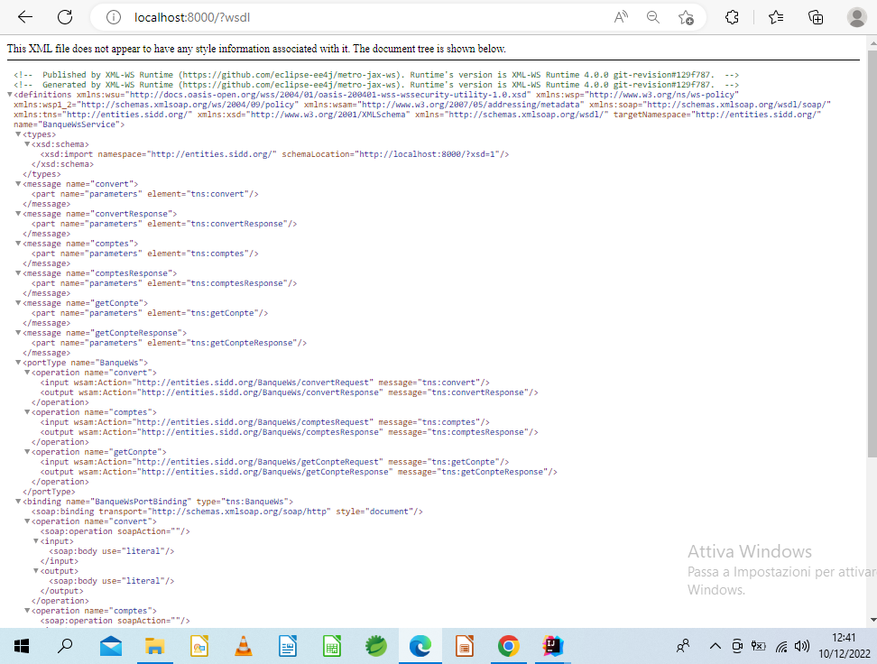

<!DOCTYPE html>
<html lang="en">
<head>
    <meta charset="UTF-8">
    <title>Title</title>
</head>
<body>

<h1>Activitè Pratique</h1>

 
<table >
    <thead>
        <th  style="width: 10%"></th>
        <th>SopRequest</th>
        <th>SopResponse</th>

    </thead>
    <tbody>
        <tr>
            <td>Convert euro in DH</td>
            <td class ="req1"></td>
            <td class="resp1"></td>
        </tr>
        <tr>
            <td>getCompte</td>
            <td class="req2"></td>
            <td class="resp2"></td>
        </tr>
        <tr>
            <td>Liste Comptes</td>
            <td  class="req3">t</td>
            <td class="resp3"></td>
        </tr>
    </tbody>
</table>
<h2>WSDL Avec le Browser Http</h2>

    

</body>
</html>